# htmltoys

Small and self-contained HTML5 canvas toys. 

Each toy comes in a single, self-contained .html file. The source never exceeds a few hundred lines and should be easy to follow. Its plain HTML and Javascript. This means that all toys can be opened locally from you hard disk without any CORS issues or the likes (with the only exception of "Phase space", because that one plays music from an external file).

[Click here to see the toys in action.](https://shermnonic.github.io/htmltoys/)

## The toys

**[Circle Flow](https://shermnonic.github.io/htmltoys/circleflow.html)**

Two flow fields interpolated at 10 steps and applied to a circle.

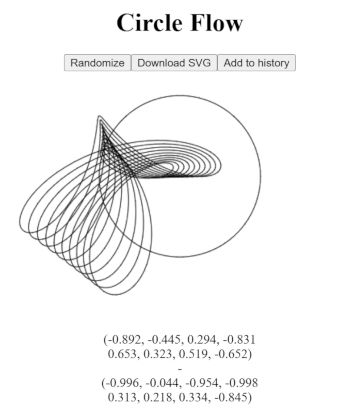

**[XorXor](https://shermnonic.github.io/htmltoys/xorxor.html)**

Generative Christmas cards 2023.

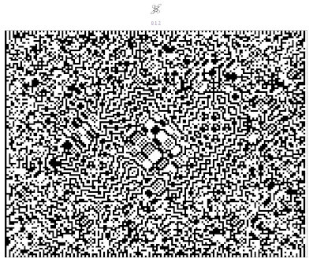

**[Winiarski](https://shermnonic.github.io/htmltoys/winiarski.html)**

Interactive game as a homage to Ryszard Winiarski (1936 - 2006).

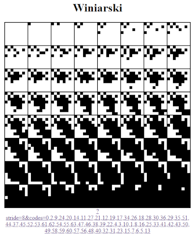

**[Saturn](https://shermnonic.github.io/htmltoys/saturn.html)**

Non-interactive size-coding; based on Minsky's HAKMEM circle algorithm. 
The source is basically a dweet player. See [my original dweet on dwitter](https://dwitter.net/d/26001). 

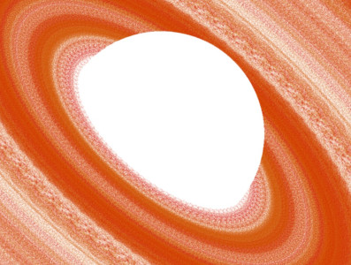

**[Infiniballs](https://shermnonic.github.io/htmltoys/balls.html)**

Interactive animation of an infinite number of balls at constant cost.

Comes in three flavours:

- [Infiniballs hue](https://shermnonic.github.io/htmltoys/balls.html?style=rainbow&mode=linear) in rainbow color (interactive)
- [Infiniballs bw](https://shermnonic.github.io/htmltoys/balls.html?style=bw&mode=clelia) draws a Clelia curve (non-interactive)
- [Infiniballs nmi](https://shermnonic.github.io/htmltoys/balls.html?style=nmi&mode=nmi) is a homage to [Jump from Public Enemy (1992)](http://www.pouet.net/prod.php?which=4210) (see [video of original effect](https://youtu.be/DNpw4xrR_Bc?t=28)) (non-interactive)

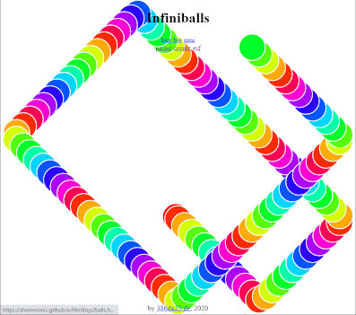

**[sinescans2](https://shermnonic.github.io/htmltoys/sinescans2.htm)**

Interactive animation.

> I love 1980's style 2D function plot algorithms; this one draws column wise using a 1-value z-buffer for hidden line removal ;-)

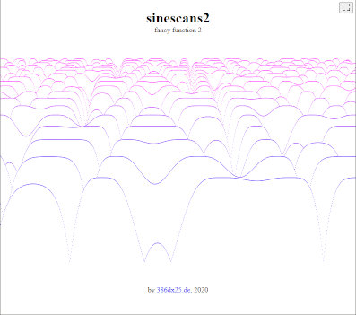

**[Chladni flower](https://shermnonic.github.io/htmltoys/chladflow.html)**

Interactive animation of a raycasted sphere, deformed by integrating a sinusoid velocity field. Instead of just adding displacements, a vectorfield is integrated. By this little trick very large deformations can be applied at good quality. 
The source is basically a minimal shadertoy player. See [my original version on shadertoy](https://www.shadertoy.com/view/3dS3zV).)

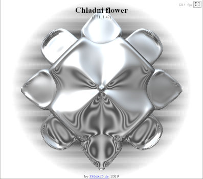

**[Hypnotoads pixel disco](https://shermnonic.github.io/htmltoys/pixeldisco.htm)**

Interactive animation. Try out the following preset kernels or paint your own:

- [box kernel preset](https://shermnonic.github.io/htmltoys/pixeldisco.htm?kernel=box&con=1111) 
- [cross kernel preset](https://shermnonic.github.io/htmltoys/pixeldisco.htm?kernel=cross&con=1111)

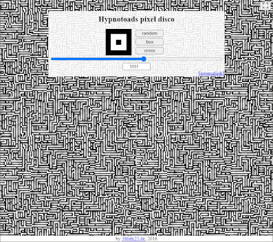

**[Phase space](https://shermnonic.github.io/htmltoys/phasespace/phasespace.html)**

Music visualization after Monro and Pressing 1998.  This was once a new years greeting. Press pause at the right moment to find a nice shape defined by the sound wave. The music is a very old recording of me and my e-guitar. (Phase space is currently the only toy spread across multiple files. A single .html file version + .ogg music is in preparation.)

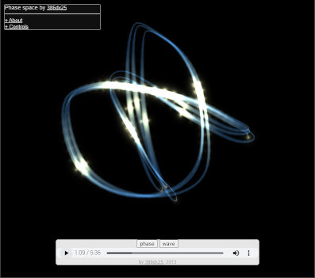

**[Serendipitous circles](https://shermnonic.github.io/htmltoys/serendipitous.htm)**

Interactive pattern generator, basically a port of a the "Serendipitous circles" article in Byte magazine from 1977. (Again based on Minsky's HAKMEM circle algorithm).

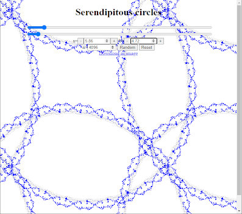

**[decoherence](https://shermnonic.github.io/htmltoys/decoherence.html)**

Interactive animation.

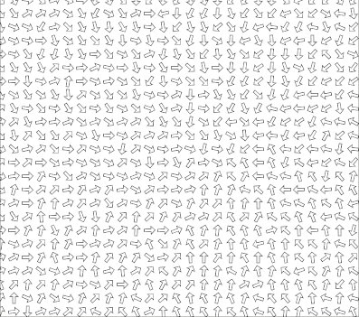

**[10print](https://shermnonic.github.io/htmltoys/10print.html)**

(Notorious.)

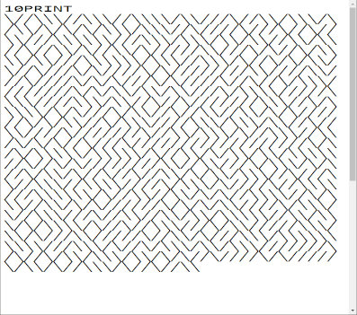
